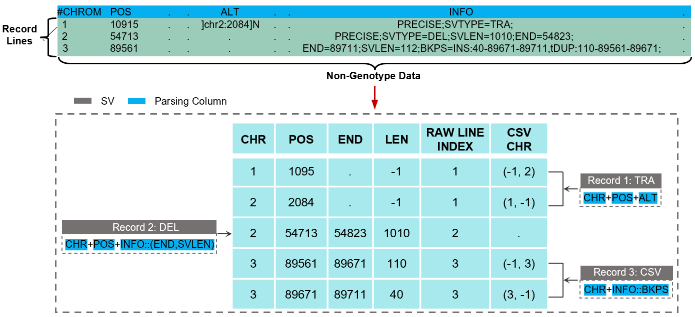

# What is SDFA

SDFA is an efficient analysis tool designed for large-scale structural variation (SV) analysis. It is based on a new SV storage format and constructs a supporting toolset. Specifically, it first designs a standardized decomposition format (SDF) for SV, which efficiently represents, stores, and retrieves any type of SV data by decomposing SV. Based on the SDF file, SDFA designs or optimizes existing SV analysis algorithms considering the performance in large-scale samples.

## What is SDF

The full name of SDF is Standardized Decomposition Format (SDF). It is a file format for splitting, storing, and compressing SV data:

We provide a detailed explanation of the attributes in the above figure as follows:

| Group              | Field        | Value Type   | Description                                                  |
| ------------------ | ------------ | ------------ | ------------------------------------------------------------ |
| `LOCATION`         | `coordinate` | int[3]       | The start and end positions of the chromosome where the current SV is located |
| `LOCATION`         | `length`     | int          | The length of the current SV  (for example, for an insertion variation, it is impossible to determine its length only relying on the `coordinate` field value) |
| `LOCATION`         | `type`       | int          | Type of the current SV                                       |
| `GENOTYPE`         | `genotypes`  | bytecode     | The genotype of the current sample under this SV             |
| `GENOTYPE`         | `metrics`    | bytecodeList | Quality metrics information of the current genotype          |
| `VCF Field`        | `id`         | bytecode     | The ID information of the current SV in the original VCF file |
| `VCF Field`        | `ref`        | bytecode     | The REF information of the current SV in the original VCF file |
| `VCF Field`        | `alt`        | bytecode     | The ALT information of the current SV in the original VCF file |
| `VCF Field`        | `qual`       | bytecode     | The QUAL information of the current SV in the original VCF file |
| `VCF Field`        | `filter`     | bytecode     | The FILTER information of the current SV in the original VCF file |
| `VCF Field`        | `info`       | bytecodeList | The INFO information of the current SV in the original VCF file |
| `CSV INDEX`        | `line`       | int          | The line number of the current SV in the original VCF file   |
| `CSV INDEX`        | `chr`        | int[N]       | If the current SV is a complex SV, record the chromosomes where all the split SVs are located |
| `ANNOTATION INDEX` | `indexes`    | int[N]       | Record the intervals of lines related to the current SV and various annotations |

In the above description, we emphasize the concepts of "splitting" and "assembling" because we split all SVs into multiple single intervals. Each single - interval SV after splitting is called a Standardized Decomposition SV (SDSV). The specific principles of splitting and reconstruction are as follows:

    

Based on the above principles, we provide an example of splitting from the original VCF file:

    

## Why use SDFA

Compared with existing tools, SDFA has the following advantages:

- SDFA provides a systematic solution to fundamentally solve the problems of large-scale SV basic analysis.

- It can efficiently handle complex SV types, such as nested SVs, while other tools often fail to correctly parse these complex SVs.

- SDFA significantly outperforms existing tools in terms of speed and efficiency, especially on large - scale datasets.
- SDFA can collaborate with tools such as Plink to conduct SV-based GWAS research and explore SV at the population level.

## Functions and Outstanding features of SDFA?

- Efficient SV data storage and retrieval: Achieved through the SDF format.

- Consistent and robust SV merging algorithm: Capable of handling large-scale sample data.

- Fast and memory-efficient SV annotation: Using the indexed sliding window algorithm.

- Novel and precise gene feature annotation: Using the Numerical Annotation of Gene Features (NAGF) method.

- Excellent performance: At least 17.64 times faster in SV merging speed and at least 120.93 times faster in annotation speed.

- Ability to parse and annotate complex SVs: The only tool that can correctly handle nested complex SVs.

- High scalability: Successfully processed 895,054 SVs from 150,119 individuals in the UK Biobank dataset, while other methods failed.

- Parallel processing capability: Can utilize multi-threading to improve processing speed.

- Flexible customization features: Such as user-defined filtering conditions and annotation resources.
