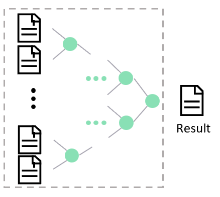

# Concatenate Mmultiple SDF files

Concatenation means adding new variant sites line by line. The most common scenario is to reassemble the variant sites of the same group of subjects that are scattered in different files (stored according to chromosomes, the number of variant sites, and file size) back into a single file (for example: the UKB's Whole genome GraphTyper SV data [interim 150k release] data). Use the following command to concatenate SDF files:

``` shell
java -jar sdfa.jar concat [options]
```

When merging multiple files, the sample names of all files will be checked, and a two-way merge sort will be used for merging in each thread. During the merging process, the coordinates are ensured to be in order and the META information is continuously updated.

<div style="text-align: center;">
    
</div>

> [!NOTE|label:Example 1]
>
> The following is the merging of 3 single - sample files (assuming here that the sample names of the 3 files are the same):
>
> ``` shell
> java -jar sdfa.jar concat -d ./data -o ./ -t 4
> ```

