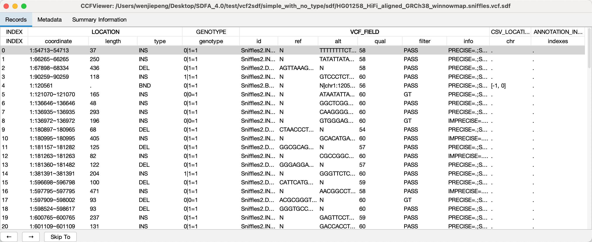

## Graphical User Interface For SDF

To facilitate the viewing of SDF files, SDFA has designed a graphical interface that makes full use of the block and column features of SDF files and has the following characteristics:

- Local Scan: Only scan the content being viewed, making use of block and column features.

- Page Navigation: Support fast navigation with low memory usage.

- Custom Display: Allow setting the viewing method when the user has a custom encoding method.

- Complete Information: Display the source information of VCF header information, SV information, and file size.

