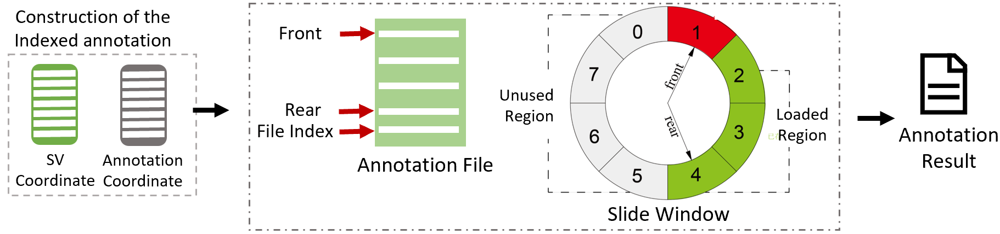

# Functional Annotation

To further locate susceptible SVs and explore their biological mechanisms, it is often necessary to perform functional annotation on SVs. In order to quickly conduct functional annotation for multiple samples and multiple resources, SDFA has designed the index sliding window algorithm shown in the figure below to accelerate the annotation process.



At the same time, in order to perform customized annotation for multiple resources, SDFA has designed the post-annotate annotation method. The output file can be customized through the configuration file shown in the figure below:

<div style="text-align: center;">
    
</div>

## Configuration File

SDFA draws on the post annotation concept of the [Vcfanno](https://genomebiology.biomedcentral.com/articles/10.1186/s13059-016-0973-5) tool and defines a configuration file for configuring annotation resources and output results. The specific explanation is as follows:


| Parameters       | Parameter Explanation                                        | Required or not<br/>(`*` represents required, `.` represents optional) |
| ---------------- | ------------------------------------------------------------ | ------------------------------------------------------------ |
| `[[annotation]]` | The start identifier for a new annotation resource           | \*                                                           |
| `file`           | The full path of the annotation resource file                | \*                                                           |
| `type`           | Type of annotation resource<br/>(3 types are supported: `gene`, `interval`, and `svdatabase`) | \*                                                           |
| `names`          | Column names of the output results                           | .                                                            |
| `fields`         | Column names of the input file                               | .                                                            |
| `opts`           | Functions corresponding to the output columns                | `Needs to match the size of names`                           |

Here we explain the above parameters through an example:

> [!NOTE|label:Example 1]
>
> Next, we will operate on the `interval_1.txt` file. This file is of the interval type, and its general content is:
>
> 
>
> Elements between single lines are separated by `\t`. Now we want to obtain the `COL1` column related to SV, so we set `fields=["COL1"]` here. At the same time, we want the output column to be named `name`, so we set `names=["name"]`. The final configuration file is as follows:
>
> ``` shell
> [[annotation]]
> file=/Users/wenjiepeng/Desktop/SDFA_4.0/test/annotation/data/interval_1.txt
> type=interval
> names=["name"]
> fields=["COL1"]
> opts=["concat"]
> ```
>
> After completing the above configuration file, we perform annotation through the following command:
>
> ```shell
> java -jar sdfa.jar annotate \
> --config /Users/wenjiepeng/Desktop/SDFA_4.0/test/annotation/data/config.txt  \
> -t 4 -d /Users/wenjiepeng/Desktop/SDFA_4.0/test/vcf \
> -o /Users/wenjiepeng/Desktop/SDFA_4.0/test/annotation/res
> ```
>
> The results after annotation are as follows:
>
> 
>
> Among them, the fileID corresponds to different SV files in this folder (`/Users/wenjiepeng/Desktop/SDFA_4.0/test/vcf`).

## Annotation Resources

SDFA supports integrating external databases for SV annotation, provided that the external data files meet the following basic format requirements:

- The tab character (`\t`) must be used as the delimiter.
- The annotation file must contain a header line, and the column names should start with the number sign (`#`) (lines starting with `##` will be ignored).

In addition, when SDFA introduces interval annotation files and SV database files to annotate existing SV data, the following specific conditions must be met:

- For interval annotation files, the following requirements must be met:

 | Column | Name             | Type    | Example |
 | ------ | ---------------- | ------- | ------- |
 | 1      | Chromosome       | String  | chr1    |
 | 2      | Start Position   | Integer | 1000    |
 | 3      | End Position     | Integer | 3000    |
 | 4      | [Feature 1 Name] | String  | V1      |
 | …      | …                | …       | …       |

- For SV database files, the following requirements must be met:

 | Column | Name             | Type    | Example |
 | ------ | ---------------- | ------- | ------- |
 | 1      | Chromosome       | String  | chr1    |
 | 2      | Start Position   | Integer | 1000    |
 | 3      | End Position     | Integer | 3000    |
 | 4      | SV Length        | Integer | 2000    |
 | 5      | SV Type          | String  | DEL     |
 | 6      | [Feature 1 Name] | String  | V1      |
 | …      | …                | …       | …       |

