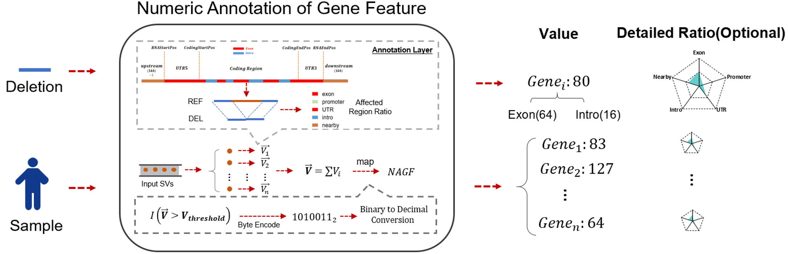

# Numeric Gene Feature Annotation



Numeric Gene Feature Annotation (NAGF) is a new annotation result proposed by SDFA for SV. NAGF uses 8 bits to represent the affected gene feature regions (such as exons, introns), and 5 bytes to represent the proportion of the affected region of each gene feature within a single SV in the gene. The 8 bits form the feature bits, and the 5 bytes form the coverage range. The following is the detailed information about NAGF:

- Feature Bits: This byte makes full use of 8 bits to represent different functional regions of a gene. The first bit indicates whether the gene is a protein - coding gene. It represents the affected exons, promoters, UTRs, introns, and nearby regions respectively, where 0 indicates not affected and 1 indicates affected. It also represents complete coverage through copy - number variation (CNV) and inversion. Note that similar ideas can use more bits to represent more subtle features, such as 5'UTR and 3'UTR.
- Number of Coverage Bytes: These five bytes in this study represent the percentage of SV - affected areas (ranging from 0 to 100) in five gene - feature regions: exons, promoters, UTRs, introns, and nearby regions.

The final result is as follows:

> GENE_NAME:Value:[xxxx， xxx，xx，xx，xxx，x]


>[!NOTE|label:Example 1]
>
>Use NAGF of SDFA to annotate the example folder and output it to the `tmp` folder in the user's home directory:
>
>``` shell
>java -jar /Users/wenjiepeng/projects/sdfa_latest/SDFA.jar ngf \
>-dir /Users/wenjiepeng/Desktop/tmp/sdfa_test/sdf_builder/vcf2sdf \
>-f /Users/wenjiepeng/projects/sdfa_latest/resource/hg38_refGene.ccf \
>-o /Users/wenjiepeng/Desktop/tmp/sdfa_test/sdf-toolkit/sdfa-nagf
>```