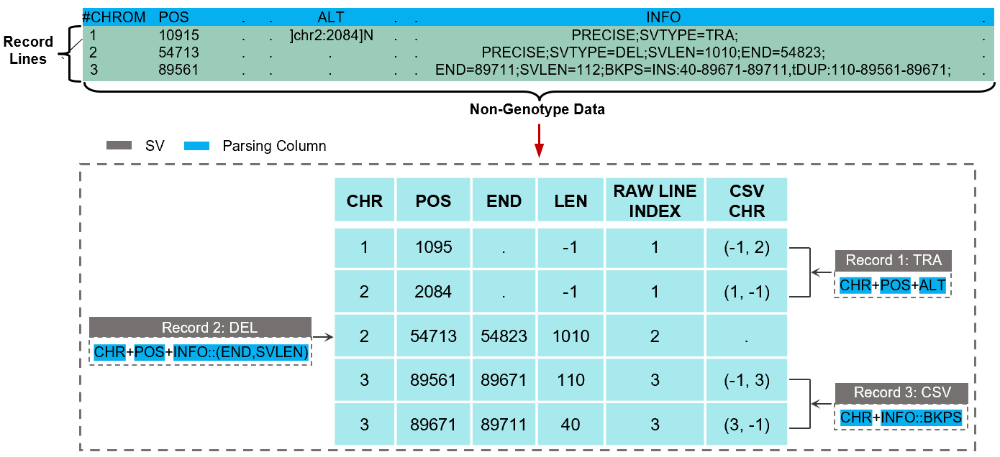

# SDFA是什么

SDFA是为大规模结构变异（Structural Variation， SV）分析设计的高效分析工具，它基于一种新的SV存储格式并构建了配套的工具集。具体而言，它首先设计了一种SV的标准化分解格式(Standardized Decomposition Format, SDF)，通过分解SV来高效地表征、存储和检索任意类型的SV数据。基于SDF文件，SDFA在考虑大规模样本下的性能下对已有的SV分析算法进行设计或优化。

## SDF是什么

SDF的全称是标准拆分格式 (Standardized Decomposition Format, SDF)，是一种拆分、存储、压缩SV数据的文件格式:

我们对上图的属性进行详细的解释：

| 字段组             | 字段         | 值类型       | 描述                                                         |
| ------------------ | ------------ | ------------ | ------------------------------------------------------------ |
| `LOCATION`         | `coordinate` | int[3]       | 当前结构变异（SV）所在染色体的起始和终止位置                 |
| `LOCATION`         | `length`     | int          | 当前结构变异（SV）的长度 (PS：对于插入变异，仅依靠坐标字段值无法确定其长度) |
| `LOCATION`         | `type`       | int          | 当前SV类型                                                   |
| `GENOTYPE`         | `genotypes`  | bytecode     | 该SV的样本基因型                                             |
| `GENOTYPE`         | `metrics`    | bytecodeList | 该SV所有基因型的质控信息                                     |
| `VCF Field`        | `id`         | bytecode     | 原始 VCF 文件中当前 SV 的 ID 信息                            |
| `VCF Field`        | `ref`        | bytecode     | 原始 VCF 文件中当前 SV 的 REF 信息                           |
| `VCF Field`        | `alt`        | bytecode     | 原始 VCF 文件中当前 SV 的 ALT 信息                           |
| `VCF Field`        | `qual`       | bytecode     | 原始 VCF 文件中当前 SV 的 QUAL 信息                          |
| `VCF Field`        | `filter`     | bytecode     | 原始 VCF 文件中当前 SV 的 FILTER 信息                        |
| `VCF Field`        | `info`       | bytecodeList | 原始 VCF 文件中当前 SV 的 INFO 信息                          |
| `CSV INDEX`        | `line`       | int          | 原始 VCF 文件中当前结构变异（SV）的行号                      |
| `CSV INDEX`        | `chr`        | int[N]       | 如果当前的结构变异（SV）是一个复杂的结构变异，记录所有拆分后的结构变异所在的染色体 |
| `ANNOTATION INDEX` | `indexes`    | int[N]       | 记录与当前结构变异（SV）及各种注释资源相关的行区间           |

在上面的描述中我们强调”拆分“和”拼装“的概念，因为我们将所有SV拆分为多个单区间，拆分后的每个单区间SV我们称之为标准拆分SV(Standardized Decomposition SV, SDSV)。具体的拆分和重构原理如下：

    

基于上述原理我们给出了一个示例，从原始的VCF文件中进行拆分：

    

## 为什么要用SDFA

相较于现有工具，SDFA具有如下优势：

- SDFA提供了一个从根本上解决大规模SV基础分析问题的系统性方案。

- 它能够高效地处理复杂的SV类型,如嵌套SV,而其他工具往往无法正确解析这些复杂SV。

- SDFA在速度和效率方面显著优于现有工具,特别是在大规模数据集上。
- SDFA可以联合Plink等工具进行SV- based GWAS研究，进行群体层面SV的挖掘。

## SDFA有哪些功能和突出特点

- 高效的SV数据存储和检索:通过SDF格式实现。

- 一致且稳健的SV合并算法:能处理大规模样本数据。

- 快速且内存高效的SV注释:使用索引滑动窗口算法。

- 新颖精确的基因特征注释:使用数值化基因特征注释(NAGF)方法。

- 卓越的性能:在SV合并速度上至少快17.64倍,在注释速度上至少快120.93倍。

- 能够解析和注释复杂SV:是唯一能正确处理嵌套复杂SV的工具。

- 可扩展性强:成功处理了英国生物银行数据集中150,119个个体的895,054个SV,而其他方法失败。

- 并行处理能力:可以利用多线程提高处理速度。

- 灵活的自定义功能:如用户定义的过滤条件和注释资源。
