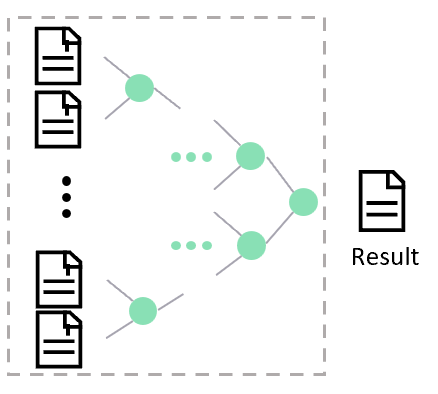

# 合并多个SDF文件

连接即按行添加新的变异位点，最常见的情形是将分散在不同文件（按照染色体、按照变异位点数量、文件大小储存）的同一批受试者的变异位点重新拼接回单独的文件（例如：UKB的 Whole genome GraphTyper SV data [interim 150k release] 数据）。使用以下指令对 SDF 文件进行连接：

``` shell
java -jar sdfa.jar concat [options]
```

多个文件合并时会检查所有文件的样本名，并在每个线程中使用 2路归并排序 进行合并。合并过程中保证坐标有序并持续更新META信息。

<div style="text-align: center;">
    
</div>

> [!NOTE|label:Example 1]
>
> 下面是对3个单样本文件进行合并（此处假设3个文的样本名一致）：
>
> ``` shell
> java -jar sdfa.jar concat -d ./data -o ./ -t 4
> ```

