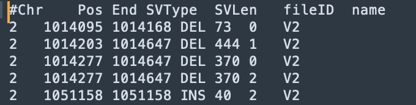

# 功能注释

为了进一步定位易感 SV 并探索其生物学原理，往往需要对 SV 进行功能注释。为快速进行多样本多资源的功能注释，SDFA 设计了下图所示的索引滑动窗口算法加速注释过程。


同时，为进行多资源定制化注释，SDFA 设计了`post-annotate`注释方式，通过下图所示的配置文件可以定制输出文件：

<div style="text-align: center;">
    
</div>

## 配置文件

SDFA 借鉴[Vcfanno](https://genomebiology.biomedcentral.com/articles/10.1186/s13059-016-0973-5)工具的`post annotation`概念，定义了一个用于配置注释资源和输出结果的配置文件，具体解释如下：

| 参数             | 参数解释                                                     | 是否必须<br />(\*代表必须，.代表可选) |
| ---------------- | ------------------------------------------------------------ | ------------------------------------- |
| `[[annotation]]` | 一个新注释资源的开始标识符                                   | \*                                    |
| `file`           | 注释资源文件的完整路径                                       | \*                                    |
| `type`           | 注释资源的类型<br />(当前支持`gene`、`interval`和`svdatabase`三种类型) | \*                                    |
| `names`          | 输出结果的列名                                               | .                                     |
| `fields`         | 输入文件的列名                                               | .                                     |
| `opts`           | 对应输出列的函数                                             | `需要和names大小匹配`                 |

对于上述参数，我们举一个例子：

> [!NOTE|label:Example 1]
>
> 下面我们对`interval_1.txt`文件进行操作，该文件是一个`interval`类型的文件，文件大致为：
>
> 
>
> 单行之间的元素通过`\t`进行分割，现在我们想获取与SV相关的`COL1`列，因此此处设置`fields=["COL1"]`，同时我们想输出列为`name`，因此设置`names=["name"]`。最后的配置文件如下：
>
> ``` shell
> [[annotation]]
> file=/Users/wenjiepeng/Desktop/SDFA_4.0/test/annotation/data/interval_1.txt
> type=interval
> names=["name"]
> fields=["COL1"]
> opts=["concat"]
> ```
>
> 完成上述配置文件后，我们通过下述指令进行注释：
>
> ```shell
> java -jar sdfa.jar annotate \
> --config /Users/wenjiepeng/Desktop/SDFA_4.0/test/annotation/data/config.txt  \
> -t 4 -d /Users/wenjiepeng/Desktop/SDFA_4.0/test/vcf \
> -o /Users/wenjiepeng/Desktop/SDFA_4.0/test/annotation/res
> ```
>
> 注释后结果如下：
> 
>
> 其中fileID对应的是该文件夹(`/Users/wenjiepeng/Desktop/SDFA_4.0/test/vcf`)下不同的SV文件。

## 注释资源

SDFA 支持集成外部数据库进行 SV 注释，前提是外部数据文件符合以下基本格式要求：

- 必须使用 tab符（`\t`）作为分隔符。
- 注释文件必须包含一个标题行，其列名以数字符号（`#`）开头（以 `##` 开头的行将被忽略）。

另外，SDFA 在引入区间注释文件和 SV 数据库文件对已有SV数据进行注释时，必须满足以下具体条件：

- 对于区间注释文件而言，需满足如下要求：

 | Column | Name             | Type    | Example |
 | ------ | ---------------- | ------- | ------- |
 | 1      | Chromosome       | String  | chr1    |
 | 2      | Start Position   | Integer | 1000    |
 | 3      | End Position     | Integer | 3000    |
 | 4      | [Feature 1 Name] | String  | V1      |
 | …      | …                | …       | …       |

- 对于SV数据库文件，需满足如下要求：

 | Column | Name             | Type    | Example |
 | ------ | ---------------- | ------- | ------- |
 | 1      | Chromosome       | String  | chr1    |
 | 2      | Start Position   | Integer | 1000    |
 | 3      | End Position     | Integer | 3000    |
 | 4      | SV Length        | Integer | 2000    |
 | 5      | SV Type          | String  | DEL     |
 | 6      | [Feature 1 Name] | String  | V1      |
 | …      | …                | …       | …       |

