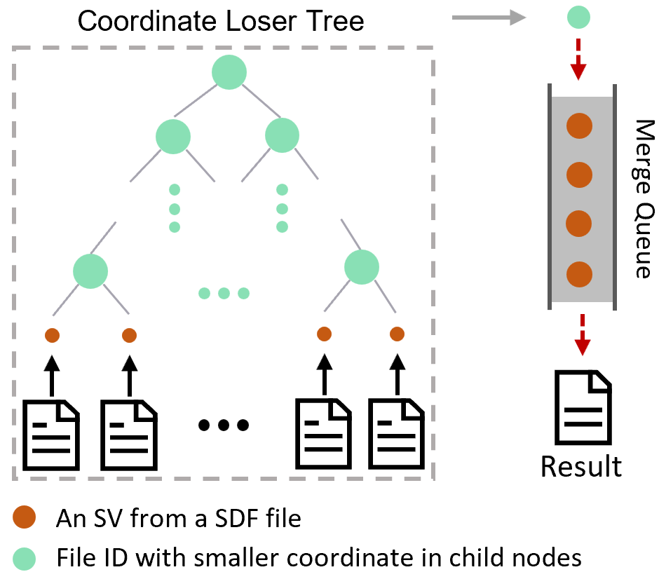

# 样本合并

为了进一步开展更大规模的 SV 研究，SDFA 开发了一种 cohort-wide 的合并算法，用于群体规模水平的SV样本合并。该算法基于SDF文件，在有序考虑所有SV数据的基础上进行k路合并：

<div style="text-align: center;">
    
</div>

目前SDFA使用position进行样本间的SV合并，具体合并逻辑如下：

SDFA维护相同类型和位置的sv有序列表，以最小位置依次添加相同类型的sv。当新增SV不满足合并条件时，当前列表中的所有 SV 都会弹出并合并为一个 SV。默认的合并条件如下：

$$
\begin{aligned}
|Pos_{first}-Pos_{new}|<Threshold \\ |End_{first}-End_{new}|<Threshold
\end{aligned}
$$

> [!NOTE|label:Example 1]
>
> SDFA将指定文件夹中的VCF文件（包括压缩文件和SDF文件）合并，并将合并结果输出到指定文件夹。命令行如下：
>
> ``` shell
> java -jar sdfa.jar -d ./data -o ./
> ```