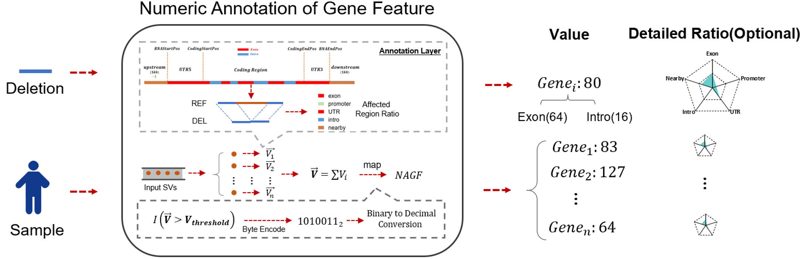

# 数值化基因注释



基因特征数值注释（NAGF）是 SDFA 针对 SV 提出的一种新的注释结果。NAGF 用 8 位表示受影响的基因特征区域（如外显子、内含子），用 5 个字节表示基因中单个 SV 内每个基因特征受影响区域的比例。8 位构成特征位，5 个字节构成覆盖范围。下面是关于 NAGF 的详细信息：

- 特征位：该字节充分利用 8 位来表示一个基因的不同功能区。第一位表示该基因是否是蛋白质编码基因。它分别表示受影响的外显子、启动子、UTRs、内含子和附近区域，0 表示未受影响，1 表示受影响。它还表示通过拷贝数变异（CNV）和倒置的完全覆盖。注意，类似的想法可以使用更多的位来表示更微妙的特征，例如 5'UTR 和 3'UTR。
- 覆盖字节数：本研究中的这五个字节代表五个基因特征区域中 SV 的受影响百分比（范围从 0 到 100）：外显子、启动子、UTR、内含子和附近区域。

最终结果如下所示：

> GENE_NAME:Value:[xxxx， xxx，xx，xx，xxx，x]

>[!NOTE|label:Example 1]
>
>使用 SDFA 的 NAGF 对示例文件夹进行注释，并输出到用户主目录下的 tmp 文件夹中：
>
>``` shell
>java -jar /Users/wenjiepeng/projects/sdfa_latest/SDFA.jar ngf \
>-dir /Users/wenjiepeng/Desktop/tmp/sdfa_test/sdf_builder/vcf2sdf \
>-f /Users/wenjiepeng/projects/sdfa_latest/resource/hg38_refGene.ccf \
>-o /Users/wenjiepeng/Desktop/tmp/sdfa_test/sdf-toolkit/sdfa-nagf
>```